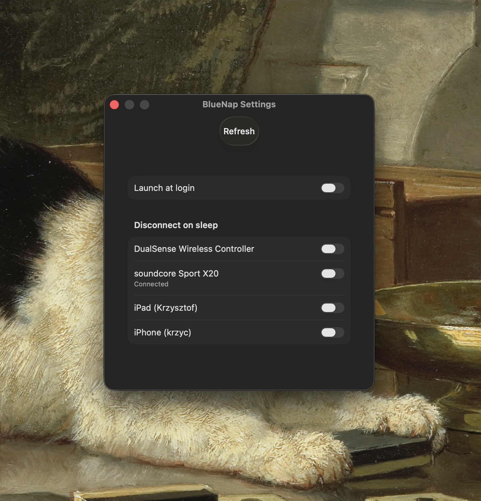

# BlueNap

**BlueNap prevents your sleeping Mac from connecting to Bluetooth accessories.**

If you pair Bluetooth headphones or speakers with both your phone & Mac it can be frustrating when your sleeping Mac connects intermittently and disrupts the audio.

With BlueNap the Bluetooth connection is switched off when your Mac sleeps, and switched on when your Mac wakes.

*BlueNap is a fork of [Bluesnooze](https://github.com/odm/Bluesnooze) by [Oliver Drobnik](https://github.com/odm), modernized (SwiftUI, Swift Package Manager, native menu, Settings window) and extended with a "Disconnect on sleep" feature. Licensed under the MIT License (see `LICENSE`).*




## Requirements

- macOS 13 (Ventura) or higher

## Installation

1. Build the release (`make all`), or grab a build from [Releases](https://github.com/root913/bluenap/releases/latest)
1. Open `BlueNap.app` in your `Applications` directory
1. *Optional*: Enable 'Launch at login' from the Settings window

## Caveats

- This app is not compatible with the "Allow your Apple Watch to unlock your Mac" feature.
- This app can't be distributed via the App Store because it uses a private API to switch Bluetooth on/off.

## How it works

BlueNap listens for the macOS sleep/wake notifications and toggles Bluetooth power via the private `IOBluetoothPreferenceSetControllerPowerState` API. It runs as a menu bar app (SwiftUI).

When you select devices under **Settings → Disconnect on sleep**, those devices are disconnected (instead of Bluetooth being powered off) when your Mac sleeps, and reconnected when it wakes.

## FAQs

### Can I disconnect only some devices on sleep?

Yes — open **Settings** and tick the devices to disconnect when your Mac sleeps. When at least one device is selected, Bluetooth stays on and only the selected devices are disconnected; if no device is selected, BlueNap falls back to switching Bluetooth off entirely.

Note: some devices (e.g. headphones) may reconnect to a sleeping Mac on their own, so selective disconnection is best-effort for auto-reconnecting hardware.

### How can I hide the BlueNap icon?

Open **Settings** and untick "Show menu bar icon". The icon disappears immediately.

You can also hide it from the terminal:

```sh
defaults write io.github.root913.bluenap hideIcon -bool true && killall BlueNap
```

### How can I restore the BlueNap icon?

The icon is the only way to open Settings, so if you hid it from there, simply launch BlueNap again (`open -a BlueNap`); the icon is restored and Settings opens.

You can also restore it from the terminal:

```sh
defaults delete io.github.root913.bluenap hideIcon && killall BlueNap
```

When you next relaunch the application it should appear in the menu bar.
